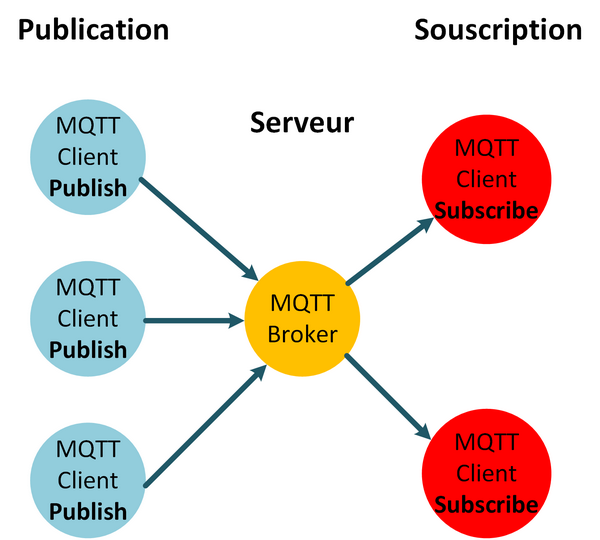

<h1>Utilisation de Mosquitto, et présentation des services de monitoring</h1>

- [Prérequis](#pr%C3%A9requis)
    - [Remarques importantes](#remarques-importantes)
    - [Images Docker utilisées](#images-docker-utilis%C3%A9es)
- [MQTT - Mosquitto](#mqtt---mosquitto)
    - [Principe](#principe)
        - [Vocabulaire](#vocabulaire)
            - [Broker MQTT](#broker-mqtt)
            - [Topics](#topics)
            - [Consumer - Consommateur](#consumer---consommateur)
            - [Producer/Publisher - Producteur](#producerpublisher---producteur)
    - [Utilisation de la CLI intégré](#utilisation-de-la-cli-int%C3%A9gr%C3%A9)
- [Démarrage](#d%C3%A9marrage)

# Prérequis

Du fait de l'utilisation de Docker, aucuns autres outils ou languages que Docker, docker-compose et Git sont nécessaire pour faire fonctionner l'infrastructure.


| Technologies | Sub-Tech            | Version    |
| ------------ | ------------------- | :--------: |
| Docker       |                     | 18.06.0-ce |
|              | Docker Compose      | 1.21.2     |
|              | Docker Compose File | v3         |
| Git Linux    |                     | 2.17.1     |
`#TODO : Add link to dl tools`

## Remarques importantes
 > Il peut être utile d'avoir `Portainer` de lancé sur votre machine, si ce n'est pas déjà fait : 

  ```sh
  docker run -d -p 9000:9000 \ 
  -v /var/run/docker.sock:/var/run/docker.sock \ 
  -v portainer_data:/data \ 
  --name=portainer \ 
  --restart=always \ 
  portainer/portainer
  ```

 > Le dossier `data` persistera les données de tous les containers qui en ont besoin ( `Grafana`, `Prometheus`, `Mosquitto` ), il faut donc donner l'accès en écriture au dossier data à qui de droit.

Faute de mieux à l'heure actuelle j'effectue cette opération avec la commande non sécurisée `sudo chmod --recursive 777 ./data`

## Images Docker utilisées

| Technology  | DockerHub Link                     | Used Tag |
| ----------- | ---------------------------------- | -------- |
| MQTT Broker | [toke/mosquitto][toke/mosquitto]   | latest   |
| Grafana     | [grafana][grafana]                 | 5.2.4    |
| Prometheus  | [prom/prometheus][prom/prometheus] | v2.4.2   |
| Telegraf    | [telegraf][telegraf]               | 1.8.0    |

[toke/mosquitto]: https://hub.docker.com/r/toke/mosquitto/
[telegraf]: https://hub.docker.com/r/library/telegraf/tags
[prom/prometheus]: https://hub.docker.com/r/prom/prometheus/
[grafana]: https://hub.docker.com/r/grafana/grafana/

# MQTT - Mosquitto

> Je ne vous conseille que trop de lire le "Hackable Magazine" n°26 paru en Septembre - Octobre 2018 des éditions Diamond (plusieurs exemplaires sont disponibles au sein du groupe), qui détaille l'installation et l'utilisation de MQTT.

## Principe

MQTT veut dire "Message Queuing Telemtry Transport", à l'instar de  [Kafka](https://kafka.apache.org/intro), c'est ce qu'on appelle un **broker** de message. C'est lui qui va permettre aux différents IOT de communiquer avec notre système (Envoyer les données de leurs capteurs, recevoir des ordres de la part des utilisateurs).

Au sein du projet, nous utilserons `Mosquitto` qui est une implémentation du service MQTT et qui dispose d'une [image Docker](https://hub.docker.com/r/toke/mosquitto/) documentée.

Voici un schéma résumant ce qu'est MQTT : 



### Vocabulaire

#### Broker MQTT

C'est ainsi que nous désignons le serveur MQTT, c'est à celui-ci que les clients se connectent et envoient/recoivent leurs données.

#### Topics 

Un topic ou sujet en français est désigné par un nom commun ; par exemple `maison/etage1/toilette/temp` et va recenser tous les messages qui seront produits à destination de ce topic.

Voici un [article](https://www.hivemq.com/blog/mqtt-essentials-part-5-mqtt-topics-best-practices) qui en dit plus au sujet des topics dans le contexte de MQTT.

#### Consumer - Consommateur 

Ce sont les clients qui s'abonnent à un ou plusieurs topics pour en consommer les données. 

#### Producer/Publisher - Producteur 

Ce sont les clients qui s'abonnent à un ou plusieurs topics pour y envoyer des données.

## Utilisation de la CLI intégré

N'hésitez pas lors des phase de test à utilisez la CLI qui permet de simuler un **consumer** ou un **producer** gràce au utilitaires `mosquitto_sub` et `mosquitto_pub`.

L'utilitaires `mosquitto_passwd` permet de créer ou modifier des utilsateurs MQTT. ([Guide d'utilisation](https://mosquitto.org/man/mosquitto_passwd-1.html))

# Démarrage 

Pour s'assurer que les containers puisse communiquer entres eux, il faut les faire appartenir à un même réseau Docker, pour celà trois options :
 - Utiliser l'interface graphique de Portainer
 - Utiliser la CLI Docker
 - Utiliser le fichier docker-compose ( [exemple](https://docs.docker.com/compose/compose-file/#ipam)  )   

J'utilise la CLI Docker pour créer un network qui s'apellera `custom`, comme ceci :

```sh
docker network create \ 
  --driver=bridge \ 
  --subnet=172.20.0.0/16 \ 
  --ip-range=172.20.0.0/16 \ 
  --gateway=172.20.0.50 \ 
  custom
```
Il suffit ensuite de lancer la commande:   

    `docker-compose up --detach`

